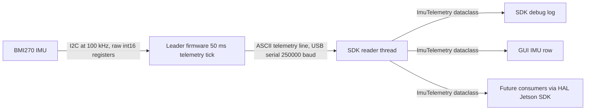
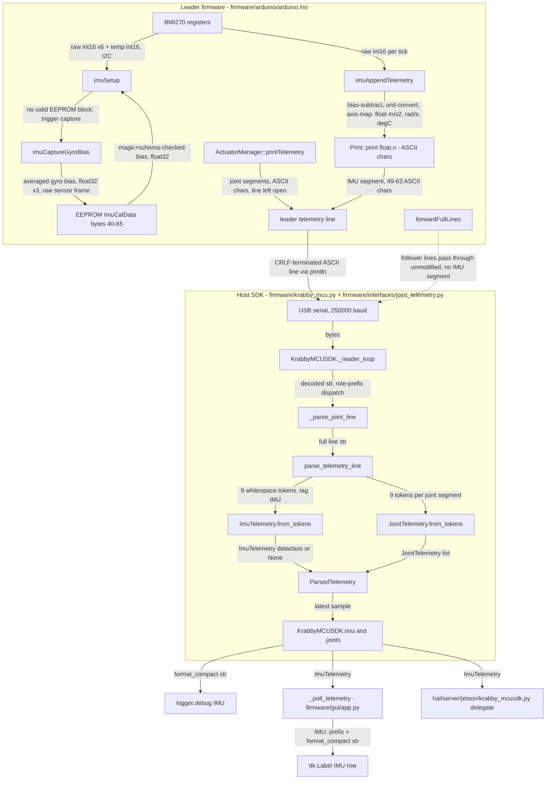

# M16 Task 1 — Design Decisions

Scope: the design for Milestone 16 Task 1 (BMI270 IMU telemetry on the leader
MCU), per the grant spec at
`patina-foundation-grants/grants/Krabby-Uno/Milestone16-I2C-Sensors/TASK-1-IMU-TELEMETRY.md`
("TASK-1" below; "AC" = its Acceptance Criteria; "§" = its numbered sections).
Companion docs: `firmware/SETUP.md` (M16 section: wiring, runbook, bench evidence),
`firmware/bench_tests/INDEX.md` (formal test procedures, "TP" below),
`docs/M16-ERROR-HANDLING.md` (host-side error, rejection, and None-return semantics —
normative for those topics; this document links rather than restates them).

**Evaluation rubric.** Every decision in this document is weighed against the project's
review standard: functionality, maintenance, correctness, efficiency, readability,
extensibility, and simplicity lie in tension, and a design that optimizes one will
sometimes shortchange another — some of these choices will turn out wrong. Because of
that, each decision here names the alternatives it rejects and treats **reversibility**
as a first-class criterion: a choice that is cheap to reverse (localized to one function,
one constant, one doc section) may be taken on thinner evidence than one that hardens
into a wire contract, a persisted layout, or a fleet-wide operational requirement.

Datasheet citations use **doc 2549** = Atmel/Microchip "ATmega640/1280/1281/2560/2561"
datasheet (<https://ww1.microchip.com/downloads/en/devicedoc/atmel-2549-8-bit-avr-microcontroller-atmega640-1280-1281-2560-2561_datasheet.pdf>).
The USART chapter of doc 2549 is Chapter 22.

---

## 1. Serial link: 250000 baud

The application serial link runs at **250000 baud**, defined once in firmware
(`#define BAUD_RATE`, `firmware/arduino/arduino.ino`) and mirrored by six host-side
defaults (`firmware/krabby_mcu.py`, `firmware/cli.py`, `firmware/gui/app.py`,
`firmware/gui/__main__.py`, `hal/server/jetson/krabby_mcusdk.py`,
`hal/server/jetson/hal_server.py`), each carrying a "must match BAUD_RATE in
arduino.ino" comment. The avrdude bootloader flash baud stays 115200
(`firmware/Makefile`, `firmware/cli.py`) — §1.4 explains why that is a separate
program, not an inconsistency.

**History:** this is the one reversal of prior design in M16 Task 1 — the link
previously ran at 115200, introduced in upstream commit `ff67ff2` (2025-12-21)
without recorded justification (§1.2); every other constant in this document is new.

### 1.1 Motivation: the link is over capacity before the IMU segment exists

Serial framing on this link is 8N1: 1 start bit + 8 data bits + 1 stop bit = **10 wire bits per
byte**. The telemetry tick is 50 ms (`TELEMETRY_INTERVAL_MS`, `firmware/arduino/sensors_config.h`).

- Link budget at 115200 baud: 115200 bits/s ÷ 10 bits/byte × 0.050 s = **576 B per tick**.
- Traffic per tick on the leader's USB uplink (three-board fleet): the leader prints its own
  telemetry line and forwards two follower lines (the telemetry block of `loop()`,
  `firmware/arduino/arduino.ino`). At the bench-measured idle line length of 180 B
  (2026-07-06, upstream build), three lines = **540 B = 94 % of budget** before the
  IMU segment is added.
- The `;IMU` segment adds 49–63 B to the leader's line (field-by-field derivation in §1.1.1
  below; the all-zeros `valid=0` path is exactly 49 B, and the bench measured exactly
  180 → 229 B). 540 + 49 = **589 B = 102 % of the 576 B budget**.
- Worst-case line lengths derived field-by-field (byte-accounting comment in
  `firmware/arduino/arduino.ino`): leader line 207–341 B, follower lines 158–278 B each — the
  ceiling is 897 B/tick, 156 % of the 115200 budget.

A link above 100 % utilization can never drain its transmit buffer within the tick; the blocking
`flush()` calls in `loop()` then stretch the control loop. TASK-1 AC 1c requires
"no measurable change to loop timing" from the IMU read — impossible to satisfy by appending
bytes to a saturated link. Raising the baud is therefore a **precondition of Task 1**, not an
optimization. At 250000 baud the budget is 1250 B/tick; 589 B nominal = **47 % utilization**,
and the 897 B worst case = 72 %.

### 1.1.1 The `;IMU` segment: 49–63 B, field by field

The segment is printed by `imuAppendTelemetry()` (`firmware/arduino/arduino.ino`). AVR's
`Print::print(float, n)` emits an optional minus sign, the integer digits (no padding), a
decimal point, and exactly `n` fractional digits; `print(int)` emits just the digits. Fixed
parts: the `";IMU "` tag = 5 B; each of the six inertial fields is followed by one space
(printed in the same loop); one space separates temperature from `valid`; `valid` prints as
`0` or `1` = 1 B. The `\r\n` belongs to the line, not the segment.

| Field | Print call | Value bound | Min (incl. trailing space) | Max |
|---|---|---|---|---|
| accel ×3 | `print(a[i], 3)` + `' '` | (raw − bias) × 9.80665 with raw ∈ ±8 g (the BMI270's power-on accel range, which `BMI270::begin()` reads but never changes) and `accelBiasG` ≡ 0 in Task 1 scope → ±78.453 | `0.000␣` = 6 | `-78.453␣` = 8 |
| gyro ×3 | `print(g[i], 4)` + `' '` | (raw − bias) × π/180 with raw ∈ ±2000 °/s (power-on gyro range); the stored gyro bias is bounded only by the same ±2000 °/s (the capture's spread gate bounds noise, not mean), so worst \|raw − bias\| = 4000 °/s = 69.8132 rad/s | `0.0000␣` = 7 | `-69.8132␣` = 9 |
| temp | `print(tempC, 1)` | 23 + raw/512 with raw an int16 → [−41.0, +87.0] °C; a failed temp read prints `nan` (3 B, shorter than the max) | `0.0` = 3 | `-41.0` = 5 |
| valid | `print(fresh ? 1 : 0)` | 0 or 1 | 1 | 1 |

- **Minimum** — the all-zeros `valid=0` path: 5 + 3×6 + 3×7 + 3 + 1 (space) + 1 = **49 B**,
  matching the bench delta 229 − 180 = 49.
- **Maximum** — every field at its widest simultaneously: 5 + 3×8 + 3×9 + 5 + 1 + 1 = **63 B**.

The accel and gyro bounds are deliberately asymmetric: `accelBiasG` has no writer in Task 1
scope (§3.1), so live accel is bounded by the sensor range alone, while a
pathological-but-persistable gyro bias widens the gyro bound to range + bias.

### 1.2 Archaeology: why 115200 existed, and prior evidence of saturation

Findings from the full git history (including `upstream` = flliver/krabby-research):

- 115200 first appears in commit `ff67ff2` (2025-12-21, the founder's first MCU commit) as
  `Serial.begin(115200)` with no comment, no commit-message rationale, and no doc mention. It is
  the Arduino community's de-facto "fast default", and it propagated unexamined through `9c0b506`
  (2026-01-01), `44fa002` (2026-01-18 firmware reorg), and `702eaab` (2026-02-19), which
  formalized it as `#define BAUD_RATE 115200`. **No commit, comment, issue, or doc anywhere in
  the history justifies the value 115200**, and no alternative rate (230400/250000/500000) was
  ever discussed before this design.
- The capacity problem was observed repeatedly, but every prior response treated symptoms:
  - `702eaab` (2026-02-19) commit message: "Still has a major problem with serial now taking too
    long to process and slowing down joint commands." The same commit added the twice-per-loop
    follower drains and a SETUP.md section on raising `SERIAL_RX_BUFFER_SIZE` 64 → 256.
  - `e7e740c` (2026-02-19, 8 minutes later): "Only flush once… so we don't block in flush() twice
    per loop (~35 ms each at 115200)" — a single telemetry batch consumed ~35 ms of the 50 ms
    tick in transmit alone.
  - `dcf9f68` / `6e2c6b1` (2026-05-14) and `3d83829` (2026-05-22) baked
    `-DSERIAL_RX_BUFFER_SIZE=256` into CI and the host-setup installers (`install.py`), and
    `1845738` (2026-06-15) into the local Makefile's `BUILD_PROPS`, regression-tested by
    `tests/unit/firmware/test_makefile_build_flags.py`.
  - `186ebc5` (2026-06-23, branch `upstream/m17` only, `firmware/COMMS_DEBUG.md`): a comms
    postmortem again circled the RX buffer as prime suspect.

  The RX-buffer enlargement treats the *symptom* (RX drops while the leader stalls transmitting);
  raising the baud removes the *cause* (TX oversubscription). The historical ~35 ms flush figure
  cross-checks the arithmetic in §1.1: at Feb-2026 line sizes, transmit time alone consumed ~70 %
  of the tick.
- Known follow-up: upstream comments near the `loop()` drain calls in
  `firmware/arduino/arduino.ino` cite the 64-byte default buffer and "~35 ms each at 115200";
  both describe conditions this design supersedes (the buffer is 256 via the Makefile define,
  and the same ~400 B batch drains in ≈16 ms at 250000: 35 ms × 115200/250000). They explain why
  the surrounding code exists and are retained as history; rewording them is a follow-up.

### 1.3 The logical safety case: why 250000 cannot be worse than 115200 on this hardware

A UART has no shared clock. Each end divides its own CPU clock to the agreed bit rate; the
receiver resynchronizes only on each start-bit edge and free-runs across the 10-bit frame, so any
rate mismatch accumulates over the frame and, past a threshold, corrupts the stop-bit sample
(framing error, doc 2549 §22.11.4).

**Divisor math (doc 2549 §22.3.1, Table 22-1).** The ATmega2560 baud divisor is the 12-bit UBRR
register: `BAUD = f_osc / (16·(UBRR+1))` in normal mode, `f_osc / (8·(UBRR+1))` in double-speed
(U2X) mode. At `f_osc` = 16 MHz:

| Rate | Exact divisor needed | Nearest UBRR | Actual rate | Error |
|---|---|---|---|---|
| 115200, normal | 16e6/(16·115200) − 1 = 7.681 | 8 | 111 111 | **−3.5 %** |
| 115200, U2X | 16e6/(8·115200) − 1 = 16.36 | 16 | 117 647 | **+2.1 %** |
| 250000, normal | 16e6/(16·250000) − 1 = 3 (integer) | 3 | 250 000 | **0.0 %** |

These rows match the datasheet's own worked table (doc 2549 Table 22-12, "Examples of UBRRn
Settings", fosc = 16 MHz column, p. 226). 250000 divides 16 MHz cleanly (16e6/250e3 = 64); 115200
does not (16e6/115200 = 138.89). The Arduino core selects the U2X variant at 115200
(`HardwareSerial::begin()`,
<https://github.com/arduino/ArduinoCore-avr/blob/master/cores/arduino/HardwareSerial.cpp>), so the
deployed error at 115200 is +2.1 %. (The core also picks U2X at 250000 — UBRR = 7,
16e6/(8·8) = 250000 exactly — so the deployed error there is likewise 0.0 %; the normal-mode
UBRR = 3 row above is the same rate by a different divisor.)

**Tolerance budget (doc 2549 §22.8.3, Tables 22-2/22-3).** For 8-data-bit frames the recommended
maximum per-end error is ±2.0 % (normal mode) or ±1.5 % (U2X). The 115200 setting — +2.1 % in U2X
mode — **exceeds the datasheet's recommendation** whenever the peer is rate-exact. It survives
in practice only by an accident described next. The 250000 setting has 0.0 % divisor error,
leaving the entire budget as headroom for oscillator tolerance (the Mega's ceramic resonator is
±0.5 %-class).

**The USB path (host ↔ leader).** The physical path is: host process → USB CDC-ACM → ATmega16U2
bridge chip → real UART wire → ATmega2560 UART0. On the USB leg, "baud" is not a clock: the host
sends a CDC `SET_LINE_CODING` request whose `dwDTERate` field is a 32-bit integer (USB CDC spec
§6.2.13), and data moves in USB bulk packets — so OS support for 250000 is a non-question. The
16U2 runs the received integer through the **same 16 MHz UBRR math** (its firmware is
`Arduino-usbserial.c` in ArduinoCore-avr). That is the accident that makes 115200 work: both ends
of the only physical UART are 16 MHz AVRs whose +2.1 % errors cancel. Any rate-exact peer (an
FTDI cable, a Jetson hardware UART) would expose the full 2.1 % against a ±1.5 % budget.
At 250000 both ends are exact regardless of peer, removing the dependence on that accident.

**The follower UART links (Serial1/Serial2, leader ↔ follower Megas).** Both ends compile from
the single `#define BAUD_RATE` in the same source tree; there is no per-board config file and no
EEPROM baud setting, so two boards built from the same commit cannot disagree — by construction,
not by procedure. (These links were never the weak point: both ends being 16 MHz AVRs, even the
115200 setting's +2.1 % canceled. The gain there is purely the utilization headroom of §1.1.)

### 1.4 Why the bootloader/flash baud stays at 115200 — and why that is safe

Flashing and application serial are two different programs with independently compiled-in baud
configurations:

- The Mega ships with a stk500v2 bootloader (`stk500boot_v2_mega2560.hex`) in the boot flash
  section (doc 2549 Chapter 29, "Boot Loader Support"; the BOOTRST fuse vectors reset into it).
  Its UART rate is a `#define BAUDRATE 115200` compiled into that binary.
- avrdude opens the port at `upload.speed=115200` from Arduino's `boards.txt`
  (`mega.menu.cpu.atmega2560.upload.speed=115200`,
  <https://github.com/arduino/ArduinoCore-avr/blob/master/boards.txt>), matching the flash
  invocations in `firmware/Makefile` and `firmware/cli.py`.

Upload sequence: DTR pulse → MCU resets → the **bootloader** configures the UART at its own
115200 → avrdude speaks stk500v2 → the bootloader jumps to address 0x0000 → only then does the
sketch's `Serial.begin(BAUD_RATE)` execute and rewrite UBRR0. The application's
`#define BAUD_RATE 250000` does not exist in the executing address space until flashing is
complete. **Changing the application baud cannot affect or brick flashing.** Conversely, raising
the bootloader baud would require reburning the bootloader with an ISP programmer on every board
for zero benefit (flashing is not on the 50 ms-tick critical path), which is why it is left alone.

### 1.5 Failure-mode analysis, including worst case for hardware and organisms

**Mechanism of a baud mismatch.** The receiver samples at the wrong rate, bit positions smear
across the frame, the stop-bit check fails → framing error (FEn flag, doc 2549 §22.11.4) → the
UART delivers garbage bytes to the parser.

**When can a mismatch exist?** Only across a version boundary: a 250000 leader talking to a
115200 follower during a rolling reflash, or a stale host config opening the CDC port at 115200.
In steady state (all boards + hosts on one commit) no mismatch is possible, because firmware baud
is a single `#define`, all six host defaults carry "must match BAUD_RATE in arduino.ino"
comments, and any baud change must move all seven sites in the same change (§1.6).

**Effect of sustained garbage on the command path** (the `loop()` dispatch in
`firmware/arduino/arduino.ino`):

- Multi-byte actuation commands (`'T'` + parseable payload; `parseCommands`,
  `firmware/arduino/command.h`) cannot be assembled by byte-noise; unparseable
  input is dropped and the actuators continue their existing hold behavior. Random noise cannot
  steer joints.
- **The honest worst case is not "robot holds still".** Two of the dispatcher's single-byte
  command codes are hazardous: `'C'` triggers `startAutoCalibration()`,
  which physically drives every joint into its mechanical stops via stall detection
  (`firmware/arduino/actuator_manager.h`), and `'B'` enters a blocking jog-bridge loop
  — a lockup (fail-safe: no actuation, but denial of service). Under a
  sustained mismatch the dispatcher consumes garbage in newline-delimited chunks (a garbled
  byte is `'\n'` with probability ≈1/256, so chunks average ≈256 B) and dispatches on each
  chunk's first byte, which is `'C'` with probability ≈1/256 — one spurious `'C'` per
  ≈256 × 256 B ≈ 64 KiB of garbage in expectation. The links carry kB/s-scale traffic to
  garble (a host link ~12 kB/s of telemetry at 589 B per 50 ms tick; a follower's uplink the
  leader's forwarded command stream), so expectation is reached within seconds to minutes of
  mixed-baud operation. So the worst case of a mixed-baud fleet is
  **spurious auto-calibration**: joints driven to their stops. For hardware, that is the load the
  calibration routine is designed to apply (stall-current-bounded); for nearby organisms, it is
  unexpected motion of every joint — the same hazard class as a legitimate auto-calibration
  issued at a surprising time.
- This single-byte-command fragility is **pre-existing upstream behavior, not introduced by this
  design** — it is equally reachable by line noise at 115200. The baud decision is relevant only
  because a version-boundary mismatch is the most likely way to ever exercise it. Two
  consequences:
  1. The **fleet-wide simultaneous reflash + host-config update** (§1.6) is a *safety
     requirement*, not hygiene.
  2. A checksum or multi-byte preamble on command lines would close the hazard properly —
     recorded as a candidate follow-up task, out of M16 scope.

**Steady-state risk of 250000 vs 115200:** unchanged-to-reduced. Same firmware on both ends of
every link (§1.3), 0 % divisor error on every link, utilization halved.

### 1.6 Operational requirement: fleet-wide simultaneous reflash

The single `#define` guarantees baud consistency *within* any commit, but nothing guarantees it
*across* a version boundary. Deployment of this design (and any future baud change) must:

1. Reflash all three boards in one session, before any multi-board operation resumes.
2. Update every host entry point in the same change (the six files listed at the top of §1).
3. Not operate the fleet mid-roll: per §1.5, a mixed-baud fleet's worst case is spurious
   auto-calibration, not silence.

A cheap CI guard closing the human factor — a test in the style of
`test_makefile_build_flags.py` that greps `BAUD_RATE` from `arduino.ino` and asserts each host
default equals it — is listed as gap V-4 in §1.7.

### 1.7 Validation status

Evidence sources: `firmware/SETUP.md` bench table (2026-07-06, solo Mega 2560 R3, 400-line
captures), `firmware/bench_tests/IMU.md` run logs, `firmware/bench_tests/INDEX.md` TP index.

| # | Claim | Status | Evidence / covering TP |
|---|---|---|---|
| V-1 | 250000 transports parseable telemetry end-to-end (16U2 bridge + macOS USB stack + production parser) | **Done (bench)** | Every M16 run (TP-IMU-02/03/04/07/08/09, all PASS): gravity 9.81 m/s² through the production parser, EEPROM cal reload, boot logs — two bench sessions (2026-07-03/06) of uncorrupted 250000 traffic |
| V-2 | No loop-timing regression from the serial change (AC 1c, serial path) | **Done (bench A/B)** | TP-IMU-05 vs TP-IMU-06: upstream@115200/180 B mean tick 50.72 ms vs M16@250000/229 B mean 50.77 ms — +0.05 ms, inside run-to-run noise |
| V-3 | IMU-attached tick timing (adds the ~4 ms I2C read inside the tick) | **Covered by TP, ready** | TP-IMU-11 |
| V-4 | Firmware↔host baud consistency enforced by CI | **Gap** | No test asserts 250000 anywhere; six host sites rely on comments. Proposed: grep-style unit test per §1.6 |
| V-5 | Three-board fleet at 250000 over Serial1/Serial2 (forwarding under 256 B RX buffers) | **Covered by TP, blocked** | TP-IMU-15 (scoping/prefix integrity) + TP-IMU-16 (timing + no-corruption criterion); blocked on the three-board rig — one Mega on the bench |
| V-6 | Long soak (hours-scale: host buffer accumulation, hall-counter line growth toward the 341 B leader-line ceiling) | **Gap** | All captures are 400 lines ≈ 20 s. Proposed: TP-IMU-17 soak, or a duration criterion folded into TP-IMU-16 at robot integration |
| V-7 | Jetson host (Linux cdc_acm, `dtr=False` open path) at 250000 | **Gap** | All bench runs used a macOS host. No TP covers the Jetson serial host; new TP needed |

Automated tests and what they do **not** cover: `test_imu_telemetry.py`
parses line content and is baud-agnostic; `test_krabby_mcu.py` mocks the serial port;
`test_makefile_build_flags.py` protects the RX-buffer define, not the baud;
`tests/integration/test_message_integrity.py` / `test_timing.py` sit above the MCU link.

### 1.8 Reading list (~1–2 h, ordered)

1. **Doc 2549, Chapter 22 (USART)** — §22.3 (baud generator, Table 22-1 equations), §22.8.3
   (Tables 22-2/22-3, error tolerance), Table 22-12 (worked UBRR examples, p. 226). ~25 min.
   Skip the register descriptions (§22.4–22.7) and all 9-bit/multiprocessor material.
2. **Nick Gammon, "Serial communications"** (<https://www.gammon.com.au/serial>) — practitioner
   walkthrough of AVR UART behavior, buffering, and failure symptoms. ~20 min.
3. **All About Circuits, "The UART Baud Rate Clock: How Accurate Does It Need to Be?"**
   (<https://www.allaboutcircuits.com/technical-articles/the-uart-baud-rate-clock-how-accurate-does-it-need-to-be/>)
   — the tolerance-budget intuition behind the "~2 % rule". ~10 min.
4. **`HardwareSerial::begin()`**
   (<https://github.com/arduino/ArduinoCore-avr/blob/master/cores/arduino/HardwareSerial.cpp>)
   — 40 lines; the U2X-first selection and the 57600 exception. ~10 min.
5. *If time remains:* any CDC-ACM overview covering `SET_LINE_CODING`/`dwDTERate` (~10 min), then
   doc 2549 Chapter 24 (TWI, i.e. I2C) as pre-reading for the rest of M16. Chapter 29 (bootloader
   internals) can be skipped — §1.4 above is sufficient.

Citation-precision note: the Table 22-12 figures (−3.5 % / +2.1 % / 0.0 %, p. 226) are verified
against doc 2549; the §22.8.3 recommended-error values (±2.0 % / ±1.5 % at 8 data bits) are the
standard megaAVR figures (identical in e.g. ATmega328P §20.8.3) — spot-check the exact 2549 page
while the PDF is open for item 1.

---

## 2. Constants (C12/C13): every value, its origin, and its trade-off

All constants below live in `firmware/arduino/sensors_config.h` unless noted. "New" means the
constant is introduced by this design. ★ marks the **most-constraining decisions**;
`BAUD_RATE` is the **only value reversal** of prior design (§1 History note).

| Constant | Value | Prior | Rationale | Spec constraint | Trade-off / what breaks if wrong |
|---|---|---|---|---|---|
| ★ `BAUD_RATE` (`firmware/arduino/arduino.ino`) | 250000 | **115200** (since `ff67ff2`, never justified) | Exact 16 MHz divider (0 % error — UBRR=7 in the U2X mode the core deploys, UBRR=3 normal — vs +2.1 %); link utilization 102 % → 47 % (§1.1, §1.3) | AC 1c ("no measurable change to loop timing") is unsatisfiable on a >100 %-utilized link | Too low: saturated link, blocking flush stretches tick. Mixed versions: §1.5 worst case. Must move with all six host defaults (§1.6) |
| ★ `I2C_BUS_CLOCK_HZ` | 100000 | new | 100 kHz standard-mode I2C; the per-tick payload (32 wire bytes, §SETUP.md timing table) needs only 2.88 ms of a 50 ms tick, so the 4× slower clock is affordable and buys noise margin on the unshielded Qwiic→Dupont run | TASK-1 §1 and AC 1b mandate 100 kHz explicitly | 400 kHz would quarter bus time but tighten rise-time/noise margins on Dupont wiring; if the OLED framebuffer writes (Task 2) blow the tick budget at 100 kHz, raising this is the documented knob — sets the 90 µs/byte cost every bus device pays |
| ★ `I2C_WIRE_TIMEOUT_US` | 10000 | new (upstream Wire default: **no timeout** — a wedged bus hangs forever) | Bounds each blocking Wire transfer so a wedged bus degrades to `valid=0` telemetry instead of stalling the gait loop. Must exceed the longest single transaction (25-wire-byte read = 2.25 ms at 100 kHz; derivation in SETUP.md) and AVR Wire's 32-byte-chunk ceiling (33 wire bytes ≈ 2.97 ms); must stay well under the 50 ms tick. 10 ms = 4.4× margin over the longest real transfer, 20 % of the tick | AC 1b: init failure must not "crash or stall the gait loop"; the timeout extends that same guarantee to runtime bus failures | Too low: false timeouts kill valid reads (spurious `valid=0`). Too high: a wedged bus eats most of a tick before degrading. Absent: one shorted SDA line halts an 18-joint robot mid-gait — the safety constant of this file. Revisit when OLED/INA228 join the bus (Tasks 2–3) |
| ★ `TELEMETRY_INTERVAL_MS` | 50 | 50 (relocated from `arduino.ino`, value unchanged) | 20 Hz telemetry; the Orin control loop runs 100 Hz, the model ~50 Hz; the IMU rides this tick by design | TASK-1 §3: move the constant here; lower it only "as an explicit, documented decision" | Lower: more proprioception rate but linearly more serial traffic (589 B/tick scales up) and more I2C time per second. This constant and `BAUD_RATE` jointly set link utilization — change either only against the §1.1 arithmetic |
| `BMI270_I2C_ADDR` | 0x68 | new | BMI270 default I2C address | TASK-1 §1: "default I2C address 0x68 (0x69 via the address jumper)" | Wrong: init fails at probe (recoverable, `valid=0`) |
| `BMI270_I2C_ADDR_ALT` | 0x69 | new | Fallback probe so a breakout with the ADR jumper cut works unmodified — true of the M16 unit in hand (bench boot log: "BMI270 online at 0x69") | same | Without the fallback the in-hand unit is dead on arrival; probing two addresses costs one failed transaction at boot only |
| `IMU_AXIS_SRC[3]` | {0,1,2} | new | Sensor→body axis permutation; identity because the breakout's mounting orientation is not final | AC 1i / TASK-1 §5: transform must exist and be documented; updated together with the firmware README when the mount is fixed | Wrong after mounting: the model trains on mislabeled body axes — silent, catastrophic for locomotion, invisible on the bench. The flip test (TP-IMU-04) exists to catch exactly this |
| `IMU_AXIS_SIGN[3]` | {1,1,1} | new | Sign half of the same transform | same | same |
| `IMU_ACCEL_G_TO_MS2` | 9.80665 | new | Standard gravity (CGPM 1901 definition), exact by convention | TASK-1 §2: "accel g → m/s² (×9.80665)" | Any other value ships subtly wrong SI units to the model; bench check "\|accel\| ≈ 9.81 at rest" validates the full scalar chain |
| `IMU_GYRO_DEG_TO_RAD` | 0.017453293 | new | π/180 to 8 significant digits — beyond float32's ~7-digit precision, so the stored constant is exact at this width | TASK-1 §2: "gyro deg/s → rad/s (×π/180)" | Truncation error at this width is below sensor noise; a wrong constant scales all body rates fed to the model |
| `IMU_CAL_SAMPLES` | 200 | new | Boot gyro-bias capture length; 200 samples averages sensor noise down ~14× (√200) on the bias estimate | AC 1g: capture at boot while stationary; TASK-1 §5 says "average N samples" with N unspecified — chosen here | Fewer: noisier bias, worse rest-rate zeroing. More: longer boot stall (see next row). Capture also requires ≥ N/2 successful reads or it aborts unsaved (`imuCaptureGyroBias()`) |
| `IMU_CAL_SAMPLE_DELAY_MS` | 5 | new | 200 samples × 5 ms ≈ 1 s of boot, an acceptable one-time (first successful boot only — EEPROM reload skips it afterwards) delay | same | Longer delay × more samples stalls every first boot; much faster sampling correlates consecutive noise samples and undercuts the averaging |
| `IMU_CAL_MAX_SPREAD_DPS` | 2.0 | new | Motion gate: reject the capture if any gyro axis spreads >2 °/s peak-to-peak — do not persist a motion-corrupted bias; leaving EEPROM unwritten retries next boot | AC 1g: "captured … while stationary" — this constant is what enforces "stationary" | Tighter: a bench with ambient vibration never saves (bias stays zero forever). Looser: motion leaks into the persisted bias. **Known limitation:** the gate bounds spread, not mean — a perfectly constant-rate rotation during capture would pass; acceptable because that scenario is not physically plausible on a powered-down-then-booted robot |
| `EEPROM_IMU_CAL_ADDR` | 40 | new | First byte of the IMU calibration block (§3 map) | TASK-1 §5: "Allocate IMU calibration at byte 40+" — the address is spec-fixed | Collision with joint CalData (0–25) or role (32–33) corrupts unrelated persisted state on every cal save |
| `EEPROM_IMU_CAL_MAGIC` | 0xC7 | new | Presence sentinel; distinct from the role magic 0xAB and from erased-EEPROM 0xFF, so uninitialized or foreign bytes never read as a valid block | TASK-1 §5: "its own magic sentinel" | Without it, factory-fresh 0xFF bytes would deserialize as garbage bias and be silently subtracted from every sample |
| `EEPROM_IMU_CAL_SCHEMA` | 1 | new | Layout version; a future struct change bumps this and old blocks are treated as absent (re-capture) instead of misread | TASK-1 §5: "a schema_version byte" | Without it, any future field change silently reinterprets old bytes as the new layout |
| `EEPROM_IMU_CAL_SIZE` | 26 | new | `sizeof(ImuCalData)` on AVR: 1+1+12+12 (§3); pinned by a `static_assert(sizeof(ImuCalData) == EEPROM_IMU_CAL_SIZE)` beside the struct, so the constant cannot silently drift from it | derived, not chosen | If stale, `EEPROM_SENSOR_CAL_NEXT_ADDR` mis-derives and Task 3's block overlaps this one — which is exactly what the static_assert makes a compile error |
| `EEPROM_SENSOR_CAL_NEXT_ADDR` | 66 (= 40 + 26) | new | First free byte after the IMU block; Task 3 (INA228 cal) and later blocks allocate from here, each with its own magic + schema | forward-looking (TASK-1 has no requirement; M16 Tasks 2–3 do) | Hard-coding 66 instead of deriving it would detach it from the static_assert chain |

Interlocking note (the C13 "most constraining" lens): `TELEMETRY_INTERVAL_MS`, `BAUD_RATE`, and
`I2C_BUS_CLOCK_HZ` jointly form the tick budget — serial wire time (589/1250 B = 47 %), I2C wire
time (3.78 ms floor = 7.6 %), and everything else must fit in 50 ms. `I2C_WIRE_TIMEOUT_US` is the
safety bound that keeps a failed bus from consuming the budget. Any future change to one of the
starred four must re-run the arithmetic in §1.1 and the SETUP.md transaction table.

### 2.1 Decision: the patched BMI270 driver library is fetched at build time (pinned + checksummed), never committed whole

TASK-1 §2 names the SparkFun BMI270 Arduino Library as the driver implementation.
Upstream cannot run on the Mega 2560 as published: its ~8 KB sensor-config blob is a
plain `const` array, which on a Harvard-architecture AVR lands in `.data` and alone
exceeds the board's 8 KB SRAM (SparkFun issue #1 reports exactly this failure on a
Mega 2560). Four small AVR patches — each tagged `Krabby patch` in-source — make it
work; together they are a ~110-line unified diff (54 insertions / 4 deletions, 6 hunks
across 3 files) against the upstream release. The design question is how that patched
library reaches `arduino-cli compile --libraries`, given that the library is ~34,000
lines and the Krabby delta is ~110.

**Decision.** The repository carries only the delta. The library tree is materialized
at build time into `firmware/arduino/libraries/` (gitignored) by a fetch step that
downloads the pinned upstream release archive, verifies its SHA-256, unpacks it, and
applies the committed patch with `git apply`. The step is a prerequisite of
`make -C firmware compile-firmware` and an explicit step before the CI compile in
`.github/workflows/publish-firmware.yml`. Because the materialized path is the same
path the build already uses, the `--libraries firmware/arduino/libraries` flag — in the
Makefile, in CI, in `tests/unit/firmware/test_makefile_build_flags.py`, and in the
SETUP.md Arduino-IDE symlink recipe — is unchanged; IDE users run the fetch once before
creating the symlink (SETUP.md owns that operator procedure).

**The pin** (a tag plus two content hashes; never a branch):

| What | Value |
|---|---|
| Upstream | `github.com/sparkfun/SparkFun_BMI270_Arduino_Library` (MIT; upstream `LICENSE.md` travels with the fetched tree) |
| Ref | tag `v1.0.3` = commit `21ea234de321da07c552f7a43cb36f7df4f73a27` |
| Archive SHA-256 | `166e99899e38bb74e5e50895e93690e5ebf00a4e70363cd9524db38db04e33ee` (`v1.0.3.tar.gz`, ~2.7 MB) |

**What the mechanism adds to the tree:**

- `firmware/arduino/patches/SparkFun_BMI270_Arduino_Library.patch` — the complete delta
  vs pristine v1.0.3, including comment-only hunks (they affect no codegen but keep
  `git apply` exact against the pinned source).
- `firmware/scripts/fetch_arduino_libs.py` — stdlib-only (urllib, hashlib, tarfile,
  `subprocess` → `git apply`; git is already a repo prerequisite), so it runs unchanged
  on the Makefile's `Windows_NT` branch. It owns a per-library table of
  (URL, ref, SHA-256, patch file): the next patched library is one table row plus one
  patch file, no new mechanism.
- A `firmware/Makefile` materialization target, prerequisite of `compile-firmware`,
  with a directory-exists/stamp guard so every build after the first is fully offline.
  The fetch lives inside the recipe — never `$(shell …)` — so `make -n` stays
  network-free (a property `test_makefile_build_flags.py` depends on).
- A `.gitignore` entry for `firmware/arduino/libraries/`.

**The four patches** (the entire reviewable surface of the dependency; these are the
three AVR traps from CLAUDE.md's conventions list, and this library is their worked
example):

| # | File(s) | Patch | Why |
|---|---|---|---|
| 1 | `src/bmi270_api/bmi270.c` + staging companion in `src/bmi270_api/bmi2.c` | Config blob moved to flash: `PROGMEM` under `#ifdef __AVR__`; `bmi2.c`'s `upload_file` stages it through a 64 B RAM chunk via `memcpy_P` | Without it the blob sits in `.data` and the sketch cannot link into 8 KB SRAM — the patch that makes the Mega build exist at all |
| 2 | `src/SparkFun_BMI270_Arduino_Library.cpp` | `read_write_len` 32 → 16 | 1 register byte + 32 data bytes overflows AVR Wire's 32-byte TX buffer |
| 3 | same | Short-read detection in `readRegistersI2C` | A short I2C read otherwise hands back stale buffer bytes as sensor data |
| 4 | same | `usDelay` split into ≤ 16383 µs slices | AVR `delayMicroseconds()` overflows above 16383 µs |

**Correctness gate: binary identity.** All §1.7 bench evidence binds to the exact
artifact `firmware/build/arduino.ino.hex`, SHA-256
`82d54323fd1ac162b6886a6ec8b4844ea63c04540bd2a892d587386e47485966`. The acceptance test
for this mechanism is therefore byte-identity: compile from the fetched-and-patched
tree and `diff` the hex against that artifact (verified — fetch+patch reproduces it
byte-for-byte). Two non-obvious consequences: (a) the fetched tree ships upstream's
archive as-is, examples and docs included — arduino-cli compiles only `src/`, and the
extra files change nothing; (b) the four dead compile units under `src/bmi270_api/`
(`bmi270_context.c`, `bmi270_legacy.c`, `bmi270_maximum_fifo.c`, `bmi2_ois.c`) must
*not* be trimmed even though `-flto -Wl,--gc-sections` strips every symbol they define:
removing link inputs reorders LTO output and yields a size-identical but
byte-different hex, which would invalidate the bench evidence for zero gain.

**Alternatives considered**, scored against the rubric in the preamble:

| Alternative | Assessment |
|---|---|
| **Commit the whole library in-tree** (vendoring) | Expresses a ~110-line delta as ~34,000 committed third-party lines; the four patches drown in the import and every future reader must take on faith that the rest is pristine upstream. Fails readability and maintenance outright; upstream (flliver) vendors no third-party source anywhere. Its one advantage — offline-from-clone with zero build steps — is nearly matched by the fetch guard (offline after first build). Rejected |
| **Fetch pinned release + committed patch** (chosen) | The repo diff *is* the four patches, reviewable as plain text. Reproducible: tag + commit SHA + archive SHA-256, loud failure on any mismatch. Matches the repo's established idiom — the root Makefile's `isaaclab-cache` target clones IsaacLab pinned to an explicit commit into gitignored `.build-cache/` ("Pin Isaac Lab to specific commit for reproducibility"), and CI already fetches a pinned arduino-cli tarball. Cost: first build and cold CI need one ~2.7 MB fetch |
| **Git submodule → patched fork** | Same bytes, worse everything else: the patches vanish from review (a submodule SHA; readers must go read fork history), every clone and CI checkout grows a `submodule update --init` step, and the build would hard-code a personal GitHub namespace as permanent infrastructure. Per-release rebase burden. Strictly dominated by the chosen row |
| **`arduino-cli lib install --git-url`** | Needs `library.enable_unsafe_install=true`, installs into the user's *global* sketchbook unless `ARDUINO_DIRECTORIES_USER` is redirected (violating the never-install-this-library-globally trap in CLAUDE.md — a global copy would shadow-conflict with the patched one), and cannot apply local patches, so it degenerates to the hosted-fork problem above. Rejected |
| **`sketch.yaml` build profile, `libraries: dir:`** | `dir:` exists only since arduino-cli 1.3.0; CI pins 1.1.1, so this buys a toolchain bump (itself forcing re-verification of binary identity) and *still* needs fetch+patch to materialize the directory it points at. Rejected |
| **Hand-rolled minimal BMI270 driver** | Deviates from TASK-1 §2, which names the SparkFun library as the implementation; discards Bosch's validated init/config sequences; produces a different binary, invalidating all §1.7 bench evidence. Rejected |
| **Upstream the patches, depend on a stock release** | Unavailable as a mechanism: SparkFun declined patch 1's approach in their issue #1 ("this config file could be stored in the program memory… we decided to not do [that] for the sake of forward compatibility"), and the repo is dormant (last commit is the v1.0.3 bump, mid-2024; PRs sit unreviewed for months). Patch 1 is the one that makes the Mega link, so the local patch set can never shrink to zero. Kept as the exit ramp below, not the mechanism |

**Failure modes.**

- *Archive drift.* GitHub's auto-generated tag archives are stable in practice but
  carry only a six-months-notice commitment, not the hard stability guarantee of
  uploaded release assets (v1.0.3 has none); the Jan-2023 gzip-compression incident is
  the precedent. Failure is loud — SHA-256 mismatch, build stops — and recovery is a
  content re-diff plus a one-line hash update. If it recurs, the escalation is a
  shallow clone pinned to commit `21ea234…`: a git SHA is content-addressed and cannot
  drift.
- *No network on first build.* A fresh clone without network fails loudly at the fetch
  step with an actionable message; after one successful materialization the build is
  fully offline. SETUP.md documents the prerequisite; bench-TP setup-from-cold
  sections list the one-time fetch alongside `arduino-cli core install`.
- *Patch drift.* Impossible against a fixed tag. The patch is re-cut only when the pin
  moves — a deliberate version bump, re-run against the binary-identity gate (or,
  after new bench baselines exist, against those).

**Reversibility (the deciding criterion).** Cheapest option on the table in every
direction. Backward: delete the gitignore entry and the fetch prerequisite, commit the
materialized tree — vendoring restored in one commit. Sideways: because the
materialized path never changed, a later move to a submodule, hosted fork, or stock
upstream release touches only the materialization step, never the compile flags, CI
compile line, tests, or IDE symlink. Forward: the per-library table generalizes — the
Task 3 INA228 driver (`firmware/bench_tests/PWR.md` forward reference) is one table
row plus one patch file under `firmware/arduino/patches/`.

**Exit ramp (recorded regardless of mechanism).** File upstream PRs for patch 3
(short-read detection) and patch 4 (usDelay split) as-is — both unconditionally
correct on every platform — and patch 2 in an upstream-acceptable form
(buffer-derived or `ARDUINO_ARCH_AVR`-guarded chunk size; a blanket 16 would halve
config-load throughput on large-buffer cores such as ESP32, which is presumably why
upstream defaults to 32). Patch 1 stays local permanently (pre-declined, above). Each
accepted patch shrinks the committed diff at the next pin bump; none is a
precondition for anything in M16.

---

## 3. EEPROM allocation

### 3.1 Byte map

The ATmega2560 has 4096 bytes of EEPROM (doc 2549, Features / §8.4). Allocated so far:

| Bytes | Owner | Contents | Written by |
|---|---|---|---|
| 0–25 | Joint calibration | `ActuatorManager::CalData` (`firmware/arduino/actuator_manager.h`), stored at address 0 via `EEPROM.put(0, data)` | `saveCalibration()` after auto-cal |
| 26–31 | — | Gap, reserved ("kept for alignment" per the comment in `arduino.ino`) | never |
| 32 | Board role | Magic sentinel `0xAB` (`EEPROM_ROLE_MAGIC`, `firmware/arduino/arduino.ino`) | `saveRole()` (M14 scope) |
| 33 | Board role | `BoardRole` enum value | `saveRole()` (M14 scope) |
| 34–39 | — | Gap, headroom (TASK-1 §5 assigns "byte 40+" to the IMU, leaving 34–39 unclaimed) | never |
| 40–65 | IMU calibration | `ImuCalData`, 26 bytes — per-field map below | `imuCaptureGyroBias()` via `EEPROM.put` |
| 66+ | Free | Next block allocates at `EEPROM_SENSOR_CAL_NEXT_ADDR` = 66 (Task 3 INA228 cal first) | future tasks |

`ImuCalData` per-field offsets (struct in `firmware/arduino/arduino.ino`; AVR-GCC gives every
scalar 1-byte alignment, so the struct has no padding and the layout is deterministic — a
`static_assert(sizeof == 26)` beside the struct turns any drift into a compile error):

| EEPROM byte(s) | Struct offset | Field | Type | Meaning |
|---|---|---|---|---|
| 40 | +0 | `magic` | uint8 | `0xC7` = block present and written by this firmware |
| 41 | +1 | `schema` | uint8 | layout version, currently 1 |
| 42–45 | +2 | `gyroBiasDps[0]` | float32 | gyro X zero-rate bias, °/s, raw sensor frame |
| 46–49 | +6 | `gyroBiasDps[1]` | float32 | gyro Y |
| 50–53 | +10 | `gyroBiasDps[2]` | float32 | gyro Z |
| 54–57 | +14 | `accelBiasG[0]` | float32 | accel X offset, g, raw sensor frame — zeros until a capture writer exists |
| 58–61 | +18 | `accelBiasG[1]` | float32 | accel Y |
| 62–65 | +22 | `accelBiasG[2]` | float32 | accel Z |

Biases are stored in the **raw sensor frame** (pre-transform) so a later
change to `IMU_AXIS_SRC`/`IMU_AXIS_SIGN` does not invalidate saved calibration. `accelBiasG` is
reserved-but-zero: the read path already subtracts it in `imuAppendTelemetry()`, so adding an
accel capture later is writer-only — no schema bump, no reader change (AC 1g's "optional accel
offset").

### 3.2 Allocation convention (why magic + schema per block)

Every persisted block carries its own one-byte magic sentinel and one-byte schema version, at the
block's first two bytes:

- **Magic** answers "has this firmware ever written here?" Factory-fresh EEPROM reads 0xFF;
  without a sentinel, erased bytes deserialize as garbage values that would then be silently
  applied (for this block: subtracted from every IMU sample). Each block's magic differs from
  every other block's (role 0xAB, IMU cal 0xC7) and from 0xFF, so a mis-addressed read of another
  block also fails the check.
- **Schema** answers "was it written in this layout?" A future field change bumps the constant;
  blocks with the old schema are treated as absent (triggering re-capture) rather than misread
  as the new layout.
- Mismatch handling is uniform: fail toward re-capture, never toward trusting stale bytes
  (`imuSetup()`, `firmware/arduino/arduino.ino`). To force a re-capture in the field, invalidate
  the magic byte.
- New blocks allocate from the previous block's derived end (`EEPROM_SENSOR_CAL_NEXT_ADDR`),
  keeping the map append-only and this document's table the single map of record.

The pre-existing joint-CalData block (address 0) predates this convention: its magic is a
*trailing* field, not a leading byte, and there is no schema. (Note in passing, since a reviewer
will trip over it: that field is declared `int magic; // 0xDEADBEEF` in
`firmware/arduino/actuator_manager.h`, but AVR `int` is 16-bit, so the assignment stores only
0xBEEF, and the check `data.magic == 0xDEADBEEF` compares the sign-extended 16-bit value
(0xFFFFBEEF as `unsigned long`) against 0xDEADBEEF — it can never be true, so saved joint
calibration is never actually reloaded. Pre-existing upstream behavior, out of M16 scope;
flagged as a candidate follow-up.) The role block (32–33) has a leading magic but no schema; it
is M14 scope (another contractor) and out of scope here.

---

## 4. Interfaces

Task 1 touches one wire protocol, one host parsing module, one SDK surface, and one GUI surface.
The table below is the complete inventory: what this design uses as-is, what it extends, and
what it creates. "Extended" always means **append-only or contract-compatible** — no pre-existing
consumer needs to change (regression-pinned; see the compatibility note in §4.1).

| Name | Kind | Status | Canonical definition | Consumers |
|---|---|---|---|---|
| Telemetry line format (`<ROLE>; <seg>;<seg>...` CRLF) | wire format | **pre-existing, extended** (append-only: optional trailing `;IMU` segment on the leader's own line) | Emitter: telemetry block of `loop()` in `firmware/arduino/arduino.ino` + `printTelemetry()` in `firmware/arduino/actuator_manager.h`; contract comment: header of `firmware/interfaces/joint_telemetry.py` | `parse_telemetry_line()`; any raw-line reader (`KRABBY_MCU_RAW_RX=1` dump); `firmware/scripts/imu_bench.py` |
| Role prefixes (`FRONT`/`UNKWN`/`LEFT`/`RIGHT` on wire; `ROLE_PREFIXES` tuple host-side) | wire format / attribute | **pre-existing, unchanged** (AC 1f: no role field added) | Wire: `roleName()` in `firmware/arduino/arduino.ino`; host: `JointTelemetry.ROLE_PREFIXES` in `firmware/interfaces/joint_telemetry.py` | `KrabbyMCUSDK._reader_loop` dispatch; `JointTelemetry.from_tokens` |
| `JointTelemetry` (dataclass, 7 fields) + `from_tokens()` | dataclass / function | **pre-existing, unchanged** (fields and 9-token contract untouched) | `firmware/interfaces/joint_telemetry.py` | `parse_telemetry_line`, `KrabbyMCUSDK.joints`, GUI `JointRow`, tests |
| `JointTelemetry.parse_line()` | function | **pre-existing, extended** (signature and return unchanged — list of `JointTelemetry`; body delegates to `parse_telemetry_line().joints`) | `firmware/interfaces/joint_telemetry.py` | legacy callers; kept for backward compat |
| `ImuTelemetry` (dataclass: `accel`, `gyro`, `temp_c`, `valid`; class constants `TAG`, `TOKEN_COUNT`) + `from_tokens()` / `from_segment()` | dataclass / functions | **new** | `firmware/interfaces/joint_telemetry.py` | `parse_telemetry_line`, `KrabbyMCUSDK.imu`, GUI, debug log, `tests/unit/firmware/test_imu_telemetry.py` |
| `parse_telemetry_line()` → `ParsedTelemetry` (`.joints: List[JointTelemetry]`, `.imu: Optional[ImuTelemetry]`) | function + dataclass (return type) | **new** (the extension point for future segments, e.g. Task 3 `BATT`, as new Optional fields) | `firmware/interfaces/joint_telemetry.py` | `KrabbyMCUSDK._parse_joint_line`, `JointTelemetry.parse_line`, `firmware/scripts/imu_bench.py`, tests. Drop/None semantics: `docs/M16-ERROR-HANDLING.md` |
| `KrabbyMCUSDK.joints` | attribute | **pre-existing, unchanged** | `firmware/krabby_mcu.py` | GUI, HAL Jetson SDK wrapper |
| `KrabbyMCUSDK.imu` | attribute | **new** (`Optional[ImuTelemetry]`, latest sample, None until first seen; retains last non-None value) | `firmware/krabby_mcu.py` | `firmware/gui/app.py` `_poll_telemetry`; SDK debug log; available to HAL via `hal/server/jetson/krabby_mcusdk.py` (delegates to `firmware.krabby_mcu.KrabbyMCUSDK`) |
| `KrabbyMCUSDK.last_error` | attribute | **pre-existing, unchanged** | `firmware/krabby_mcu.py` | GUI status bar. Semantics: `docs/M16-ERROR-HANDLING.md` |
| Parse-diagnostics surface (drop-reason enumeration, drop counters, throttled SDK warnings) | dataclasses / attributes | **new** — inventoried and specified in `docs/M16-ERROR-HANDLING.md`, which owns these semantics | `firmware/interfaces/joint_telemetry.py` (parser side); `firmware/krabby_mcu.py` (SDK side) | SDK logging; tests |
| Host baud default (250000) | attribute (ctor/CLI defaults, 6 sites) | **pre-existing, value reversed** (§1 History note; dossier: §1) | `#define BAUD_RATE` in `firmware/arduino/arduino.ino` is authoritative; mirrors in the six host files listed in §1 | every serial open on the host side |
| `JointTelemetry.format_compact(target=None)` | display format | **pre-existing, unchanged** | `firmware/interfaces/joint_telemetry.py` | SDK DEBUG log (`_parse_joint_line`, `firmware/krabby_mcu.py`) |
| `ImuTelemetry.format_compact()` | display format | **new** — `a:(x,y,z)m/s2 g:(x,y,z)rad/s T.tC[ STALE]` (accel %.2f, gyro %.3f, ` STALE` suffix when `valid` is False) | `firmware/interfaces/joint_telemetry.py` | SDK DEBUG log (`logger.debug("IMU %s", ...)`); GUI IMU row |
| GUI IMU readout | display format | **new** (one `ttk.Label` row, `"IMU: " + format_compact()`, `"IMU: —"` until first sample) | `firmware/gui/app.py` (`_build_ui` / `_poll_telemetry`) | human operator |
| `;IMU` wire segment | wire format | **new** (normative grammar in §4.1) | Emitter: `imuAppendTelemetry()` in `firmware/arduino/arduino.ino`; parser: `ImuTelemetry.from_tokens` in `firmware/interfaces/joint_telemetry.py`; contract comment in both files ("keep in sync") | `parse_telemetry_line` and downstream |
| `ActuatorManager::printTelemetry()` | function (firmware) | **pre-existing, extended** (contract change: does not terminate the line; the caller appends sensor segments then `println()`) | `firmware/arduino/actuator_manager.h` | `arduino.ino` `loop()` |
| `imuSetup()` / `imuCaptureGyroBias()` / `imuAppendTelemetry()` / `isI2CClusterBoard()` | functions (firmware) | **new** | `firmware/arduino/arduino.ino` | `setup()` / `loop()` |
| `sensors_config.h` constants | attribute (compile-time contract) | **new** except `TELEMETRY_INTERVAL_MS` (relocated, value unchanged) | `firmware/arduino/sensors_config.h`; per-constant table in §2 | firmware; Tasks 2–3 allocate from `EEPROM_SENSOR_CAL_NEXT_ADDR` |
| EEPROM `ImuCalData` (26 B at bytes 40–65: magic 0xC7, schema 1, 3×gyro-bias f32, 3×accel-bias f32, raw sensor frame) | wire format (persisted) | **new** | Struct: `firmware/arduino/arduino.ino`; layout constants: `sensors_config.h`; byte map: §3.1 | `imuSetup()` (read), `imuCaptureGyroBias()` (write); no host-side reader |

Pre-existing quirk observed (not introduced, not fixed here): the wire emits `UNKWN` while
`ROLE_PREFIXES` lists `UNKNOWN`; benign because the role token occupies its own `;`-segment and
never reaches 9 tokens.

### 4.1 `;IMU` segment: wire specification (normative)

Canonical definitions in code: emitter `imuAppendTelemetry()`
(`firmware/arduino/arduino.ino`); parser `ImuTelemetry.from_tokens`
(`firmware/interfaces/joint_telemetry.py`). Each carries a contract comment naming the other
("keep in sync"); this section is the spec both implement. Byte-length derivation: §1.1.1.

```text
imu_segment ::= ";IMU " accel accel accel gyro gyro gyro temp SP valid
accel       ::= f3 SP            ; Print::print(float,3): ["-"] digits "." 3 fractional digits
gyro        ::= f4 SP            ; Print::print(float,4): 4 fractional digits
temp        ::= f1               ; Print::print(float,1): 1 fractional digit; "nan" on failed temp read
valid       ::= "0" | "1"
SP          ::= " "              ; exactly one space; each inertial field carries its own trailing space
```

- **Position / terminator**: last segment of the leader's own line (`FRONT`/`UNKWN` boards
  only; never on forwarded `LEFT;`/`RIGHT;` lines), immediately before the line's `\r\n`
  (`println`). The segment has no terminator of its own; the leading `;` is part of the
  segment's 5-byte `";IMU "` tag.
- **Field order / units**: accel x,y,z (m/s², body frame, = (raw − bias) × 9.80665, raw ∈ ±8 g
  power-on range, accel bias ≡ 0 in Task 1 scope); gyro x,y,z (rad/s, body frame,
  bias-subtracted, = (raw − bias) × π/180, raw ∈ ±2000 °/s); die temp (°C, = 23 + raw/512,
  raw int16 → [−41.0, +87.0]); valid (1 = fresh read this tick, 0 = sensor absent/failed —
  accompanying fields print as zeros).
- **Numeric bounds**: |accel| ≤ 78.453; |gyro| ≤ 69.8132 (range + worst persistable bias);
  temp ∈ [−41.0, 87.0] or `nan`.
- **Lengths** (incl. leading `;`, excl. line CRLF): min **49 B** (all-zeros `valid=0` path:
  5 + 3×6 + 3×7 + 3 + 1 + 1; bench-confirmed, 229 − 180 = 49), max **63 B**
  (5 + 3×8 + 3×9 + 5 + 1 + 1).
- **Parser acceptance**: exactly 9 whitespace-split tokens with `tokens[0] == "IMU"`;
  fields 1–7 must parse as finite floats (AVR non-finite spellings `nan`/`inf` are rejected
  post-parse; `ovf` fails `float()`); `valid` is `int(token) == 1`. Rejection and drop
  semantics: `docs/M16-ERROR-HANDLING.md`.
- **Compatibility**: append-only. Pre-M16 parsers require exactly 9 tokens *per joint segment*
  in `from_tokens` and drop non-conforming segments, so they silently ignore `;IMU`
  (regression-pinned in `tests/unit/firmware/test_imu_telemetry.py`).

---

## 5. Serialization formats

Four serialized representations carry IMU data; only two are contracts. In order of stiffness
(hardest-to-reverse first): the persisted EEPROM block, the wire segment, then the two display
strings (debug log, GUI), which no machine parses and which may change freely.

### 5.1 Provenance: what is inherited, what is precedented, what is novel

| Format | Introduced by M16? | Precedent | Verdict |
|---|---|---|---|
| Telemetry line (role prefix + `;`-separated segments of space-separated tokens) | No — inherited intact; M16 only appends | Upstream contract (wire comment in `actuator_manager.h`; header of `joint_telemetry.py`) | **inherited-convention** |
| Joint segment (`<name> <pos> ... <saf>`, 9 tokens) | No | — | **inherited-convention** (untouched) |
| `;IMU` segment (§4.1) | Yes | Follows the existing joint-segment convention exactly: one `;`-delimited segment, space-separated fields, first token identifies the segment, `Print::print(float, n)` field encoding — same line, same framing. Only the fixed `IMU` tag (vs a joint name) is new | **new-but-precedented** |
| `JointTelemetry.format_compact` | No — upstream. Verified: `git log -S format_compact` → first repo-wide at `2cab33f` ("Clean up some telemetry code to make it more OO"), in `joint_telemetry.py` at `44fa002` (firmware reorg); present unchanged in `upstream/main` | — | **inherited-convention** (unchanged) |
| `ImuTelemetry.format_compact` | Yes | Deliberately mirrors `JointTelemetry.format_compact`'s shape: compact single-line debug string, comma-packed parenthesized tuples, fixed decimals, consumed by the same SDK DEBUG log path | **new-but-precedented** |
| GUI IMU readout | Yes | Reuses `ImuTelemetry.format_compact` verbatim (single source of display truth) inside the existing tk GUI | **new-but-precedented** |
| EEPROM `ImuCalData` block | Yes | `EEPROM.put/get` mechanics inherit `ActuatorManager::saveCalibration/loadCalibration`; the leading-magic byte is precedented by the role block (0xAB at byte 32); the **leading magic + schema-version pair as a uniform per-block header** is a convention M16 formalizes (§3.2) — neither prior block has a schema byte | **novel** (the magic+schema block convention), on inherited storage mechanics |

### 5.2 Why extend the custom text protocol rather than adopt a standard one

The telemetry line is a custom ASCII protocol — it is not NMEA, not protobuf, not CBOR, not a
length-prefixed binary frame. That is inherited, and Task 1 deliberately does **not** revisit it:

- **No second framing scheme.** Introducing a binary or standard serialization for one segment
  would put two framings on one wire, and every reader (parser, raw dump, a human with a serial
  monitor) would need both. The single highest-value property of the current protocol is that
  one convention covers the whole line.
- **The cost is affordable.** ASCII decimal costs 49–63 B/segment vs ~29 B for a packed binary
  equivalent (6×f32 + f32 temp + flag). The §1.1 budget shows 47 % utilization at 250000 baud
  with the ASCII segment included — the compression is not needed, and a binary segment would
  break the "old parsers silently skip unknown segments" property that makes the change
  deployable without host lockstep.
- **Debuggability is load-bearing.** Bench procedures (TPs in `firmware/bench_tests/`) and the
  `KRABBY_MCU_RAW_RX=1` raw dump read the wire directly; every bench PASS in §1.7 leaned on
  human-readable lines.
- **Reversibility.** A future move to a binary or standard protocol is a fleet-wide,
  host-lockstep change regardless of what Task 1 does — appending one more ASCII segment adds
  nothing to that future cost.

So the decision is: **extend the inherited custom format, append-only; introduce no new
serialization scheme.** The only genuinely novel serialized convention in Task 1 is the EEPROM
magic+schema block header (§3.2), justified there.

### 5.3 The evolution rule (normative for future tasks)

New telemetry data (e.g. Task 3 battery) is added as a **new trailing `;`-segment with a unique
first token** (`BATT`, ...), never by widening an existing segment:

1. Emitters append the new segment after existing ones on the appropriate board's own line.
2. `parse_telemetry_line` gains a new `Optional` field on `ParsedTelemetry` and a new
   `from_tokens` dataclass; existing fields and callers are untouched.
3. Parsers ignore segments they do not recognize (§7) — old hosts against new firmware keep
   working; new hosts against old firmware see `None` for the absent segment.
4. A backward-compat regression test in `tests/unit/firmware/test_imu_telemetry.py`
   pins property 3 for the IMU segment; each new segment adds one in the same style.

Display strings (`format_compact`, GUI text) are **explicitly not contracts**: nothing may parse
them, and they may change without a design-doc update.

### 5.4 Display formats

- **SDK debug log**: `ImuTelemetry.format_compact()` renders
  `a:(x,y,z)m/s2 g:(x,y,z)rad/s T.tC[ STALE]` — accel %.2f, gyro %.3f, a ` STALE` suffix when
  `valid` is False — emitted via `logger.debug("IMU %s", ...)` on the same DEBUG path that logs
  `JointTelemetry.format_compact`. Precision is display-only (wire precision is §4.1's f3/f4/f1).
- **GUI**: one label row, `"IMU: " + format_compact()`, placeholder `"IMU: —"` before the first
  sample. Reusing `format_compact` keeps a single source of display truth; a dedicated GUI
  format is a trivial later change if operators need one.

---

## 6. Information flow

### 6.1 High level

One IMU sample per 50 ms telemetry tick flows from the sensor to the host consumers; there is
no host→IMU path (calibration is firmware-autonomous, §3).



Follower boards (`LEFT`/`RIGHT`) never emit `;IMU`; their lines pass through the leader
unmodified and carry joint segments only.

### 6.2 Function level, with the data shape at each hop

Data changes representation five times: sensor registers → floats (firmware) → ASCII chars
(wire) → tokens → dataclass (host) → display string.



Notes on the hops:

- `imuSetup` runs once at boot: probe 0x68 then 0x69, load or capture calibration (§2, §3);
  failure ships zeros with `valid=0` forever after, never stalling `loop()` (AC 1b).
- `forwardFullLines` is a byte-level pass-through for follower lines — it neither parses nor
  appends; the `;IMU` segment exists only on the line the leader itself prints.
- `parse_telemetry_line` splits on `;`, routes the `IMU`-tagged segment to
  `ImuTelemetry.from_tokens` and 9-token joint segments to `JointTelemetry.from_tokens`, and
  drops anything else (decision in §7; rejection/None semantics in
  `docs/M16-ERROR-HANDLING.md`).
- `KrabbyMCUSDK.imu` holds the latest parsed sample and retains the last non-None value between
  ticks; the GUI polls it rather than subscribing.

---

## 7. Decision: unknown telemetry segments are dropped

**Decision.** `parse_telemetry_line` silently drops any `;`-segment it does not recognize (not
a well-formed joint segment, not a known tag such as `IMU`). No env var, no strict mode, no
per-segment warning in the parser. Host-level observability (error strings, logging, raw-line
dump) lives at the SDK layer — semantics in `docs/M16-ERROR-HANDLING.md`.

**Why dropping is the point, not an accident.** The append-only evolution rule (§5.3) only
works *because* parsers ignore what they do not understand: it is the property that lets a new
firmware ship a `;IMU` (or Task 3 `BATT`) segment while old hosts keep operating, and old
firmware run against new hosts. A parser that errors on unknown segments converts every fleet
version skew into a host-side failure — recreating, at the parse layer, the version-lockstep
problem §1.6 exists to manage at the baud layer.

**Alternatives considered**, scored against the rubric in the preamble:

| Alternative | Assessment |
|---|---|
| **Drop silently at the parse layer** (chosen) | Functionality: enables append-only evolution. Correctness: unknown ≠ malformed — a segment from newer firmware is valid data this host predates; treating it as an error is the incorrect reading. Efficiency: zero cost on the 20 Hz hot path. Simplicity/maintenance: the parser stays a pure function with no config, env, or logging state. Extensibility: new segments require zero changes to existing consumers |
| **Env-var strict mode** (e.g. raise on unknown segment when set) | Adds config plumbing into a pure function and a bimodal contract (same input, two behaviors) that tests must cover twice. Its diagnostic value — "is the firmware sending something I don't parse?" — is already available losslessly via the `KRABBY_MCU_RAW_RX=1` raw-line dump, which shows the exact wire bytes without a parser mode. Rejected: cost without unique benefit |
| **Counter-only** (count dropped segments, expose on the SDK) | Cheap and genuinely useful for noticing version skew in the field; the right home is the SDK/observability layer, not the parser's return contract. Deferred, not rejected — see reversibility below |
| **Log-unknown-once per tag** | Same layer conclusion as the counter; also requires global memory of seen tags inside what is otherwise a pure function. Deferred to the SDK layer if field experience demands it |

**Reversibility (the deciding criterion).** Dropping is the most reversible option on the
table: it is local to one function in `firmware/interfaces/joint_telemetry.py`, and any of the
alternatives (counter, once-per-tag log, even a strict flag) can be layered on later without
touching the wire format, the dataclasses, or any caller. The converse is not true — shipping a
strict mode now creates a behavior some tool will come to depend on, coupling future segment
additions to host rollout order. Choose the cheap-to-reverse default; escalate observability at
the SDK layer if version skew actually bites.
