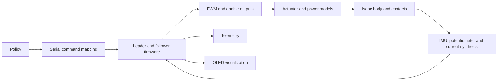

# From adapter tests to firmware simulation

The IMU support library provides a deterministic input boundary, not a complete
firmware simulator. It can be linked by a host executable without Unity. A caller
can queue raw readings, advance time, inject acquisition failures and inspect
hardware operations while running the actual adapter.

## Existing execution boundaries

The OLED simulator uses the production display model and renderer. Its native
trace emitter constructs measurements from UI state; it does not run the IMU
adapter, OLED hardware adapter or Arduino loop.

The inspected Isaac path uses `IsaacSimMCUSDK.apply_command` and the action system
to apply simulated joint-position targets. It does not execute MCU firmware.
The power-poll characterization harness extracts portions of the sketch; that is
a migration test, not the basis for claiming whole-firmware simulation.

## Incremental path

1. **IMU replay.** Link `imu_native_support` to a headless runner. Queue recorded
   raw samples and faults, run the adapter/calibrator, and export measurements.
   Define any replay format when that tool is built; none is introduced now.
2. **Sensor-to-display replay.** Feed those measurements into the production
   display model and renderer, then reuse the OLED visualization. Preserve its
   existing UI and trace behavior as a separate mode. This still excludes the sketch.
3. **Whole-firmware execution.** Compile the actual sketch against a host runtime
   covering serial ports, clocks, GPIO, ADC, EEPROM and device APIs. Begin with
   one process per MCU to isolate sketch globals; coordinate their time and UART
   delivery. Unify existing test substitutes only around demonstrated shared needs.
4. **Closed-loop Isaac evaluation.** Feed policy commands through the firmware's
   serial command path and drive a body model from the resulting PWM/enable outputs.
   Generate sensor observations from the evolving physical state. Start with one
   deterministic environment and a fixed policy before considering parallel training.

## Decisions required before whole-firmware integration

- Use simulator-owned time and deterministic delivery. Busy startup waits and
  blocking serial reads need scheduler support; merely freezing millis between
  calls to loop would hang some paths. Define how execution yields and when the
  plant advances before choosing a host-runtime interface.
- Specify action semantics. The inspected Isaac position-target path is not a
  direct substitute for firmware PWM. Include actuator geometry, speed/force
  behavior, screw holding, stops, and current sensing at the intended fidelity.
- Synthesize IMU specific force and angular rate at the sensor mounting, including
  gravity conventions and any mounting offset. Convert to the sensor frame and
  raw scales once, with quantization, saturation and sample timing explicit.
  Injecting Euler angles into a display-only model bypasses these checks.
- Generate potentiometer ADC readings from actuator position and calibration.
  Current and battery observations require a load/power model or clearly labeled
  scripted inputs; body kinematics alone do not supply INA measurements.
- Preserve distinct sensor, firmware, telemetry, display, policy and physics rates.
  Sensor disconnects and partial reads should remain independently injectable.
- Establish reference trajectories and compare host execution with hardware logs.
  Host C++ does not emulate AVR instruction timing, integer widths, interrupts,
  memory limits or electrical behavior. The real Mega build remains necessary.
- Profile one-environment evaluation before deciding how to support many RL
  environments. Process isolation is an initial correctness choice, not a claim
  that it scales to training throughput.

Only the adapter test support and this design path are implemented in the IMU
stage. Replay, combined visualization and the firmware/Isaac bridge remain future
work requiring their own concrete designs and review.
