# M16 Task 4 — Power-FSM bench test procedure (AC 4k / §8)

Bench-validate the protective power state machine by driving the **Pack INA228 VBUS**
from an adjustable, current-limited DC supply (e.g. the Korad KA3005D) across the five
thresholds and recording the observed transitions + timings. **No battery, no high
current** — the FSM steps only on the Pack VBUS voltage, which is a single-ended,
high-impedance sense node, so a bench supply on `VIN−` is sufficient and safe.

**Scope boundary:** this validates the FSM *logic* (thresholds, debounce, hysteresis,
one-way OVER_VOLT, park/ack/force-off, low-power loop). It does **not** validate the
real pack's load-sag behavior — tuning the thresholds against the actual LiFePO4 pair
under load is **AC 4h**, physical, and stays with Fletcher/the real pack.

## Shutdown hierarchy

```mermaid
stateDiagram-v2
    [*] --> Normal

    state PoweringDown {
        [*] --> UnderVoltageSoft
        [*] --> Manual
        UnderVoltageSoft --> GraceGate
        Manual --> GraceGate
        GraceGate --> OrinPoweroff: exact SHUTDOWN_ACK
        OrinPoweroff --> ShutdownSleep: clean poweroff / telemetry stops
        GraceGate --> ForcedRailCut: no response for 60 s
        OrinPoweroff --> ForcedRailCut: 15 s safety deadline
        ForcedRailCut --> ShutdownSleep
    }

    state EmergencyShutdown {
        [*] --> HardCut
        [*] --> OverVoltage
        HardCut --> ShutdownSleep: silent; no handshake
        OverVoltage --> TerminalSleep: emit EMERGENCY_SHUTDOWN
    }

    Normal --> PoweringDown: graceful trigger
    Normal --> EmergencyShutdown: immediate trigger
    ShutdownSleep --> Resuming: voltage above RECOVERY
    Resuming --> Normal
    TerminalSleep --> [*]: manual reset only
```

`POWERING_DOWN` opens the graceful transaction. Only an exact
`PWR 1 SHUTDOWN_ACK` received while that transaction is active is accepted; it
means the Orin has accepted the request and begun clean poweroff, not that
poweroff has completed. Stopped Orin telemetry is the completion signal. The
rail-cut deadlines remain a 60 s no-response fallback and a 15 s safety deadline
after ACK.
HARD_CUT and OVER_VOLT both bypass that gate. HARD_CUT emits no message, exactly
as specified; stopped telemetry is the Orin's signal. OVER_VOLT emits the
approved `EMERGENCY_SHUTDOWN over_voltage` best-effort notification and never
waits for an ACK.

The diagram states the complete required workflow. Exact ACK parsing and
transaction scoping are implemented here; detecting stopped Orin telemetry as a
successful completion signal remains an explicit AC 4i implementation item.

## Thresholds & timing (from `sensors_config.h` — cross-check before testing)

| Constant | Value | Meaning |
|---|---|---|
| `PACK_WARNING_THRESHOLD` | 24.8 V | telemetry-only WARN (instant, no debounce) |
| `PACK_SOFT_CUT_THRESHOLD` | 24.0 V | graceful shutdown (park + signal Orin) |
| `PACK_HARD_CUT_THRESHOLD` | 22.4 V | immediate stop after qualification → SLEEP |
| `PACK_RECOVERY_THRESHOLD` | 26.4 V | auto-resume gate (2.4 V hysteresis) |
| `PACK_OVER_VOLT_THRESHOLD` | 29.6 V | immediate one-way protective cutout |
| `POWER_CUT_DEBOUNCE_TICKS` | 4 | ≈200 ms sustained below SOFT/HARD before latch |
| `POWER_RECOVERY_POLL_MS` | 30 000 | SLEEP recovery-poll cadence |
| `POWER_LOW_BATT_BLINK_MS` | 10 000 | SLEEP LED/OLED blink cadence |
| `ORIN_FORCE_OFF_MS` | 60 000 | force-off deadline after a shutdown command |
| `ORIN_ACKED_OFF_MS` | 15 000 | shortened deadline once SHUTDOWN_ACK arrives |

Telemetry tick is 20 Hz (`TELEMETRY_POLL_INTERVAL` 50 ms), so 4 ticks ≈ 200 ms.

## Setup

1. Leader board on USB; Pack INA228 (0x40) online (confirm via the boot log
   `INA: Pack (0x40) online`). Midpoint may be absent — the FSM only needs Pack VBUS.
2. Bench supply **+ → Pack INA228 `VIN−` screw terminal**, **− → shared GND**. Current
   limit low (e.g. 100 mA); VBUS draws ~nothing.
3. Serial monitor at 250000 baud. Keep the supply ≤ 30 V (Korad max; VBUS abs-max is 85 V).
4. Optional: watch `ORIN_PWR_PIN` (drives HIGH=powered) and `STATUS_LED_PIN` on a DMM/LED,
   and the OLED for the SLEEP/over-volt splashes.

> In SLEEP/OVER_VOLT the low-power loop suppresses normal telemetry and the `K` console —
> the observable signals there are the **PWR messages**, the **LED blink**, and the
> **OLED splash**, not the BATT line.

## Procedure — record each transition

Set the supply, hold, watch the `power_state` byte in the BATT frame (and the PWR lines).

1. **Baseline NORMAL.** Set 26.5 V (> RECOVERY). Confirm `power_state = 0 (NORMAL)`,
   telemetry normal, actuators enabled.
2. **WARN (instant).** Lower to 24.6 V (< WARN 24.8). Confirm `power_state → 1 (WARN)`
   with no debounce delay; no behavior change (telemetry-only).
3. **SOFT_CUT (debounced).** Lower to 23.8 V (< SOFT 24.0) and hold. After ~4 ticks
   (~200 ms): `power_state → 2 (SOFT_CUT)`, one `PWR 1 POWERING_DOWN under_voltage_soft`
   line emitted, actuators park (holdAll) + followers de-energized (`H` forwarded), and
   the 60 s ack/force-off window opens. **Record time-to-latch.**
4. **Ack shortening.** During the window, type `PWR 1 SHUTDOWN_ACK` in the console. Confirm
   the force-off deadline shortens from 60 s to ~15 s (`ORIN_ACKED_OFF_MS`) and
   `ORIN_PWR_PIN` drops after it. **Record.**
5. **HARD_CUT → SLEEP.** From NORMAL again, drop to 22.0 V (< HARD 22.4) and hold. After
   ~4 ticks: `power_state → 3 (HARD_CUT)` then the dedicated low-power loop (SLEEP): polls
   only the Pack INA at ~30 s, blinks LED/OLED at ~10 s, goes dark below HARD, motors
   gated. **Record.**
6. **OVER_VOLT (terminal, one-way).** From NORMAL, raise to 29.8 V (≥ OVER_VOLT 29.6).
   On the first valid qualifying reading: `power_state → 4 (OVER_VOLT)`, one
   `PWR 1 EMERGENCY_SHUTDOWN over_voltage` line, over-volt splash. **Then lower the
   voltage and confirm it does NOT clear** (one-way latch). **Record.**
7. **RECOVERY.** From a SLEEP state (via step 3 or 5), raise to 26.5 V (> RECOVERY 26.4)
   and hold. Confirm `power_state → 6 (RESUMING) → 0 (NORMAL)`, one
   `PWR 1 RESUMING voltage_recovered` line, `ORIN_PWR_PIN` back HIGH, actuators re-enabled.
   Note the recovery is gated by the ~30 s poll. **Record.**
8. **Under-voltage debounce rejection.** Briefly dip below SOFT (24.0) for < 4 ticks
   then return above it. Confirm **no latch**. OVER_VOLT is intentionally not
   debounced: the first valid reading at or above 29.6 V must latch the cutout.

## Timings table (fill on the bench)

| # | Transition | Trigger V | Expected debounce | Observed latch time | Notes |
|---|---|---|---|---|---|
| 2 | NORMAL→WARN | 24.6 | instant | | |
| 3 | WARN→SOFT_CUT | 23.8 | ~200 ms (4 ticks) | | PWR POWERING_DOWN seen? park seen? |
| 4 | ack shortens force-off | — | 60 s → ~15 s | | ORIN_PWR_PIN drop time |
| 5 | NORMAL→HARD_CUT→SLEEP | 22.0 | ~200 ms | | blink/poll cadence observed |
| 6 | NORMAL→OVER_VOLT | 29.8 | first valid reading | | stays latched after V drops? |
| 7 | SLEEP→RESUMING→NORMAL | 26.5 | ~30 s poll | | Orin re-power, actuators re-enabled |
| 8 | transient below SOFT | dip <4 ticks | no latch | | |

## Pass criteria

All eight transitions occur at the documented thresholds, OVER_VOLT acts on its first
valid qualifying reading and does not self-clear, the under-voltage transient is
rejected, and the ack shortens the
force-off window. Any deviation → note it against the `sensors_config.h` constant and
raise before the real-pack run (4h).
